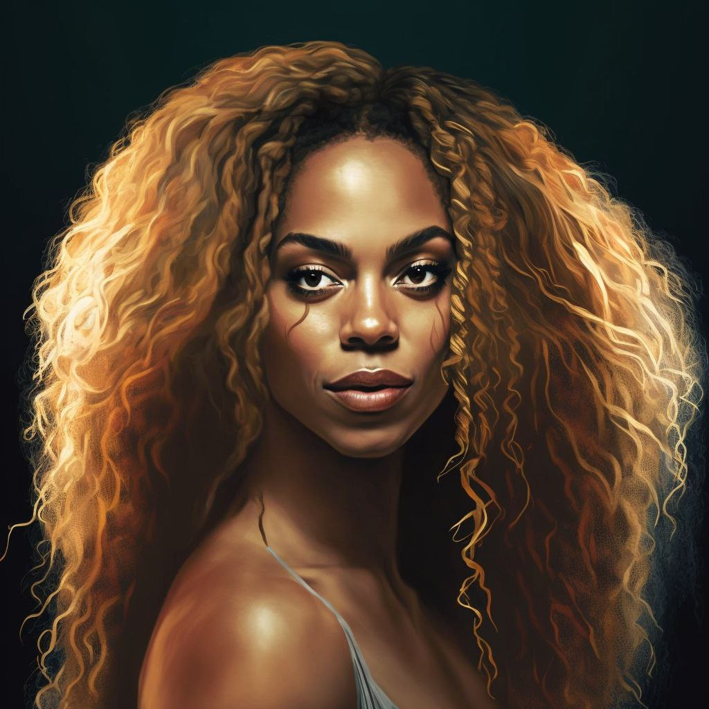

# 🔉 NFT's Concept

## _Non-Fungible Tokens (NFT)_&#x20;

\-> _Utilize technology of cryptocurrency to create unique digital assets. Ownership of collectibles, real estate, and even game characters with their respective scores, items, etc. can be registered. The market for NFTs has grown exponentially in recent months, with even sales at traditional auction house Christie's of London. Those who purchase NFTs seek exclusivity and status._

_-> An NFT, or non-fungible token, is a digital record of ownership of a specific asset, whether real or virtual. A token is a cryptoactive, a digital asset that exists only within a shared database. Assets, digital or tangible, can be divided into two groups:_

_**Fungible, which can be replaced or divided without loss of value.**_&#x20;

* _money;_&#x20;
* _bitcoin;_&#x20;
* _Fraction of a piece of land;_&#x20;
* _Fan tokens;_&#x20;
* _oil;_&#x20;

#### _Non-fungible, where each item is unique, and non-divisible._&#x20;

* _Lot A-32 of the Alphaville 4 condominium;_&#x20;
* _A certain seat for a theater or show;_&#x20;
* _10/100 copy of a work of art;_&#x20;
* _Autographed baseball card;_&#x20;
* _User @tuba33play of the game Dota II;_&#x20;
* _Bronze medal of boxer Abner Teixeira._

#### _How to invest in NFT?_

_->  The first thing an NFT investor must understand is that trading involves only one record in the shared database, the blockchain. In other words, the ownership of the item is not being traded._

_Therefore, when investing in NFT of a digital artwork, you are purchasing the right to a "certified copy" recognized by the artist. It is important to verify that the item is authorized by its creator._

_There are various marketplaces for NFTs, including OpenSea, Nifty Gateway, Rarible, SuperRare, among others. In addition to acting as virtual art galleries, they allow artists to create NFTs without needing programming or cryptography knowledge._

#### Integration of NFT's with Music AI

_-> We will create a special collection for our investors, starting with the sale of our instrument collection. This will condition future opportunities already in development to the possibility of creating our own NFTs or even consolidated artist NFTs. We will leverage artificial intelligence to enhance the process, as demonstrated by some examples of future collections and the OpenSea link to an already available collection for sale, which is completely exclusive._

_-> This available collection will have several benefits, including inclusion in events on our roadmap to engage our partners and NFT-purchasing investors. It is a unique opportunity to come together and discuss all Music AI updates._

_-> Initially, we will have 19 unique NFTs as per the model outlined below._



<figure><figcaption></figcaption></figure>

 

<figure><figcaption></figcaption></figure>

 

<figure><figcaption></figcaption></figure>

